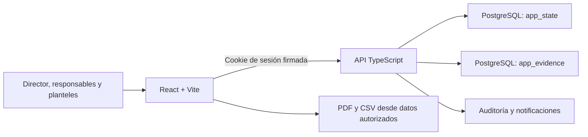
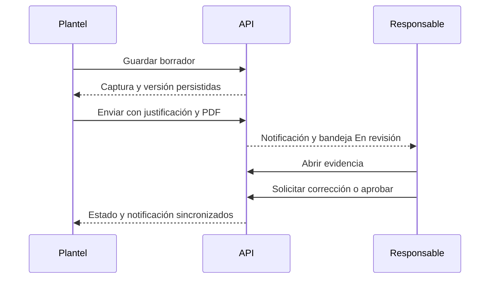

# Arquitectura técnica

## Propósito

ADPeak implementa SIGI-POA DGEMS para capturar, revisar, aprobar y reportar
indicadores oficiales de educación media superior. Frontend, API, migraciones,
importador y documentación viven en un monorepo npm.

## Componentes



## Frontend

Ruta: `apps/frontend`.

- Presenta una navegación distinta por rol.
- Consume `/api/v1` con `credentials: include`.
- No decide permisos ni persiste tokens de producción.
- Renderiza plantillas derivadas del catálogo oficial.
- Anticipa validaciones y cálculos; el backend vuelve a validarlos.
- Genera PDF y CSV desde `reporte.indicadores[].datos[]`.

## Backend

Ruta: `apps/backend` y adaptadores serverless en `api/`.

- Autentica usuarios y firma sesiones con expiración.
- Aplica permisos en cada endpoint, independientemente de la interfaz.
- Valida campos, fórmulas, evidencia y transiciones de estado.
- Persiste estado compartido en `app_state` bajo mutaciones serializadas.
- Guarda contenido PDF separado del JSON en `app_evidence`, identificado por
  checksum y sujeto a autorización.
- Registra historial y notificaciones de dominio.

## Persistencia

`app_state` mantiene usuarios, indicadores, capturas, notificaciones, auditoría
y secuencias. `app_evidence` conserva binarios PDF fuera del documento JSON. El
esquema se crea mediante migraciones versionadas y también se verifica de forma
defensiva al iniciar.

El harness `qa:*` copia ambas tablas a una base aislada, ejecuta mutaciones y
restaura el snapshot exacto. Los scripts rechazan ejecución destructiva cuando
`APP_ENV=production`.

## Flujo principal



## Autoridad y seguridad

- El backend es autoridad de autenticación, alcance, cálculos y estados.
- CORS usa origen explícito o mismo origen; nunca `*` con credenciales.
- Producción aplica CSP y encabezados de seguridad.
- Los datos oficiales se generan de forma reproducible; `FMT-*`, `TMP-*` y
  plantillas internas no entran al catálogo operativo.
- Evidencias y endpoints privados requieren sesión y alcance autorizado.

## Verificación

```bash
npm ci
npm run repo:verify
npm run docker:config
npm run demo:config
```

`repo:verify` incluye tipado estricto, pruebas, build, importador, auditoría de
dependencias, escaneo de secretos, higiene del repositorio y dry-run del harness
QA.
