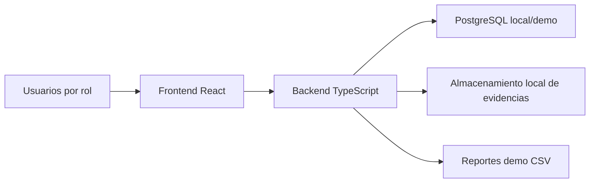
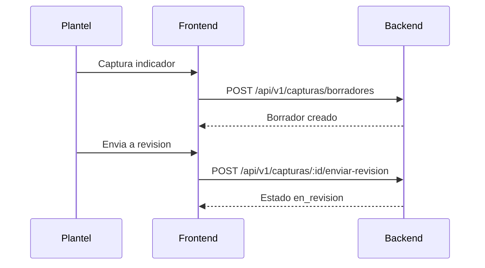

# Arquitectura Tecnica

## Proposito

ADPeak implementa SIGI-POA DGEMS: un sistema para capturar avances de indicadores, revisar informacion por rol y consultar reportes institucionales con datos controlados.

El repositorio esta preparado como monorepo npm para que frontend, backend, scripts, migraciones y documentacion evolucionen juntos sin depender de artefactos externos no versionados.

## Componentes



## Frontend

Ruta: `apps/frontend`.

Responsabilidades:

- Login local por rol para demo y validacion.
- Captura de indicadores por plantel.
- Gestion visual de usuarios e indicadores.
- Dashboard y reportes basicos.
- Consumo de API mediante `apps/frontend/src/api`.

Carpetas principales:

| Ruta | Uso |
| --- | --- |
| `src/components` | Componentes visuales y formularios. |
| `src/api` | Clientes HTTP hacia backend. |
| `src/context` | Contextos globales, como sesion local. |
| `src/hooks` | Hooks de negocio frontend. |
| `src/assets` | Imagenes y logos versionables del sistema. |

## Backend

Ruta: `apps/backend`.

Responsabilidades:

- API HTTP local.
- Healthcheck.
- Dataset demo.
- Flujo de capturas en memoria para demo funcional.
- Validacion de configuracion.
- Scripts de seed, validacion y migraciones.

Carpetas principales:

| Ruta | Uso |
| --- | --- |
| `src` | Codigo de API, configuracion y stores. |
| `scripts` | Utilidades ejecutables por npm. |
| `migrations` | SQL versionado para ambiente local/demo. |

## Configuracion

El frontend usa:

- `VITE_API_URL`
- `VITE_API_BASE_URL`

El backend usa:

- `APP_ENV`
- `BACKEND_PORT`
- `DATABASE_URL`
- `AUTH_SECRET`
- `CORS_ORIGIN`
- Variables de almacenamiento de evidencias.

La referencia completa esta en [../development/CONFIGURATION.md](../development/CONFIGURATION.md).

## Flujo principal



## Limites actuales

- La demo de captura usa almacenamiento en memoria en backend.
- La base PostgreSQL local existe para migraciones y datos demo, pero no todos los flujos productivos persisten en tablas finales.
- Las credenciales de login son de demostracion; no representan autenticacion productiva.
- Exportaciones actuales son basicas y deben endurecerse cuando se cierre el modulo productivo de reportes.

## Criterio de calidad

Antes de integrar cambios:

```bash
npm run repo:verify
npm run docker:config
npm run demo:config
```

Si un cambio modifica flujo, ambiente o endpoints, actualizar README y documentos relacionados en el mismo PR.
